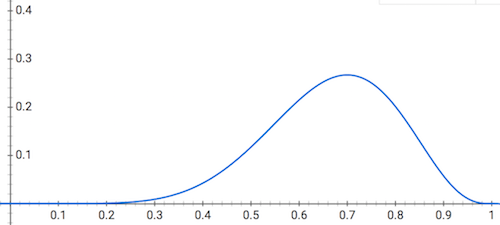
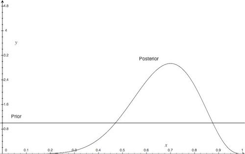
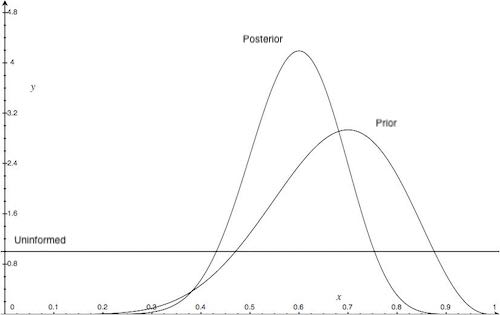

# Statisics through coin flipping

The goal of this article is to define some commonly used statistics terminology using an example of a coin flip.

In statistics, one often tries to answer a question by conducting multiple experiments. For example, someone has given us a coin, and we want to determine the probability that the coin lands showing heads. The first thing we do is construct a *model*, an equation describing the process. The classic way to model a coin flip is to say every flip has an identical chance of showing heads. That is, the coin lands showing heads with probability *p* and tails with probability *1-p*.

Now, one flip won't tell us anything about *p*, we will need to flip the coin multiple times. So our experiment will be to flip the coin over and over again, counting the number of heads and tails we see. The probability of getting *h* heads and *t* tails given the probability of getting a head is *p* can be written:

 = \binom{h+t}{h} p^{h} (1-p)^{t}")

The | symbol is read "given" or "conditioned on". This is called a *binomial distribution*.

After we are done with our coin flips, *h* and *t* are fixed but *p* is still unknown. Therefore, for a given *h* and *t*, we can look at this equation as a function of *p*:

=\binom{h+t}{h} p^{h} (1-p)^{t}")

When we do this, we call L(p) the *likelihood* function since it tells us how likely a particular value of *p* is for our observed data. For example let's say we flip the coin 10 times and see heads 7 times. Then our likelihood function is:

=\binom{10}{7} p^{7} (1-p)^{3}")

Plotting the likelihood function:

The likelihood function has a max when *p* = 0.7.  Intuitively this makes sense since this reflects the exact ratio of heads and tails we see in out data. 0.7 is called the *maximum likelihood estimator* for our parameter *p* since it maximizes the likelihood funciton.

So far we have considered *p* a fixed number that we are trying to guess. This is called the frequentist approach. That is, in the frequentist approach, we consider the model parameters fixed and we are trying to guess them. An alternative is the Bayesian approach. In this approach, we consider the model parameters as themselves being drawn from a distribution and we try to guess this distribution. Why would we want to do this? In the above example, we might want to ask what the probability is that *p* really is 0.7. One may argue this is a strange question since it basically amounts to "what is the probability that the probability of getting heads is 0.7?" but it turns out to be useful. If *p* is fixed, then we can't answer this question directly since either *p* is 0.7 or it isn't. There is no randomness in *p* [see 1]. By putting a probability distribution behind it we have a place to model our uncertainty in *p*.

So let's talk about the Bayesian approach. First, we state Bayes Theorem, which is an equation that let's us go from talking about the probability of the data given the parameters to the probability of the parameters given the data. We can then ask questions about the probability of the parameters since they are no longer fixed numbers. Bayes Theorem is:

=\frac{Pr(B|A)Pr(A)}{Pr(B)}")

For a derivation see [2] below. For our coin flipping example, this translates to:

=\frac{Pr(H=h,T=t|P=p)Pr(P=p)}{Pr(H=h,T=t)}")

Let's talk about the terms on the left hand side one at a time.

__Pr(H=h,T=t|P=p)__: This is defined above and is just our probability for seeing *h* heads and *t* tails. After we run our experiment *h* and *t* are fixed so this is really the likelihood function of *p*.

__Pr(P=p)__: This is the distribution of our parameter *p*. We get to choose this and we'll discuss this more.

__Pr(H=h, T=t)__: This is our probability of getting h heads and t tails independent of *p*. Since this is only dependent on our observed *h*'s and *t*'s this ends up being a normalization constant so we don't need to worry about it. For the curious, what does it mean that this is independent of *p*? Ultimately this means, once we pick our distribution for P, Pr(P), we will take the weighted average (expected value) over all possible values of P. Since this is a constant one often sees people ignoring this term and writing:

 \propto  Pr(H=h,T=t |P=p) Pr(P=p)")

Now, Pr(P=p|H=h, T=t), is called the *posterior distribution* since it is our guess at the distribution of the parameter after we observe our data, the coin flips. Pr(P=p) is call the *prior distribution* since it is our guess at the distribution of the parameter before the coin flips. Using this terminology we can say:

    Posterior Distribution &#8733; Likelihood function * Prior Distribution

It would be nice if Pr(P=p|H=h, T=t) and Pr(P=p) had the same functional form with different parameter values. For example, it would be nice if Pr(P=p|H=h, T=t) and Pr(P=p) were both normal distributions with different mean and variance values. Now we can arbitrarily pick Pr(P) so, while, we can't make both Pr(P=p|H=h, T=t) and Pr(P=p) both normal we can often make it so they are the same distribution. In our case, we choose Pr(P=p) to be a Beta distribution. A Beta distributions domain is [0,1], making it a plausibly distribution for probabilities, and it has 2 parameters, alpha and beta:

 = \frac{\Gamma(\alpha+\beta)}{\Gamma(\alpha)\Gamma(\beta)} p^{\alpha-1} (1-p)^{\beta-1}")

Ignoring the Gamma functions, this looks very similar to the binomial distribution except instead of the random number of heads and tails we have fixed parameters *alpha* and *beta* and the distribution is over p. The Gamma functions evaluate to a constant in this equation and serve as a normalizing term [see 3].

If we substitute the Beta distribution for our prior distribution we see:

 \propto  Pr(H=h,T=t |P=p) * Pr(P=p) \propto \binom{h+t}{h} p^{h} (1-p)^{t} * \frac{\Gamma(\alpha+\beta)}{\Gamma(\alpha)\Gamma(\beta)} p^{\alpha-1} (1-p)^{\beta-1}")

We can drop the constants *(h+t choose h)* and the Gamma functions since these are just constant terms. *h* and *t* will come from our observed data and *alpha* and *beta* are chosen when we pick our prior distribution. So we have:

 \propto p^{h} (1-p)^{t} * p^{\alpha-1} (1-p)^{\beta-1} = p^{h+alpha-1} (1-p)^{t+beta-1}")

So Pr(P=p|H=h,T=t) is proportional to *p^(h+alpha-1) (1-p)^(t+beta-1)*. Since it's a distribution, we can introduce a normalization constant to make the proportion an equality. Notice it has the form of a Beta distribution with constants *h+alpha* and *t+beta*, so we know the normalization constant and can write:

 = \frac{\Gamma((h+\alpha)+(t+\beta))}{\Gamma(h+\alpha)\Gamma(t+\beta)} p^{h+alpha-1} (1-p)^{t+beta-1}")

Since Pr(H=h, T=t | P=p) is a *Binomial Distribution* we say the Beta distribution is a *conjugate prior* to the Binomial Distribution. That is a `Beta Distribution * Binomial Distribution = Beta Distribution`.

To make this more concrete, we can pick the prior distribution to be a Beta distribution where alpha = beta = 1. With this choice Beta(P) = 1:

=1")

This is called an uninformative prior because this is the uniform distribution and all values of *p* are equally likely. We are baking in no bias to our guess of p.  Now, we flip the coin and get 7 heads. Then our posterior distribution becomes:

^{t} * Prior = 1320 * p^{7}(1-p)^{3} * 1 = 1320 * p^{7} * (1-p)^{3}")

Now let's say we run another experiment and flip the coin 15 times, getting 8 heads. This time we can set as our prior distribution the posterior distribution we just calculated from the first experiment and then compute the new posterior distribution:

^{t} * Prior = 84987760*(p^{8}(1-p)^{7})*(p^{7}(1-p)^{3}) = 84987760p^{15}(1-p)^{10}")

This shows the advantages of the Bayesian approach and using a conjugate prior distribution. As we run more experiments our posterior distribution changes reflecting our updated belief about the true value of *p*. In this case, we see the distribution hone in on the true underlying *p*. We update our guess of the posterior distribution incrementally which helps computationally. We don't need to store all previous coin flip values and re-estimate *p* from scratch each time.

Hopefully this coin flipping example has helped make the following statistical terms concrete:

* Likelihood function
* Maximum likelihood estimator
* Bayes thereom
* prior distribution
* posterior distribution
* conjugate prior

[1] All the randomness comes from our experiment, that is the actual values of each flip. To answer questions about our certainty of our estimate of *p* we then resort to confidence intervals and thought experiments about what would happen if we ran the 10 flip experiment over and over again.

[2] This is derived from

Pr(A, B) = Pr(A) Pr(B|A)

That is the probability of both A and B occuring (the left hand side) is the probability of A occuring multiplied by the probability of B occuring given A has occurred (the right hand side).

Using the same reasoning:

Pr(A, B) = Pr(B) Pr(A|B)

Setting both right hand sides to each other we see:

Pr(A) Pr(B|A) = Pr(B) Pr(A|B) => Pr(A|B) = Pr(A) Pr(B|A) / Pr(B)

[3]  Gamma is defined to be an integral, but for an integer argument it evaluates to a factorial. That is if *i* is an integer:

\Gamma(i) = (i-1)!

In general:

\Gamma(z) = \int_{0}^{\infty}x^{z-1}e^{-x}dx

See: https://en.wikipedia.org/wiki/Gamma_function

Reference:
Wikpedia fair coin writeup: https://en.wikipedia.org/wiki/Checking_whether_a_coin_is_fair
